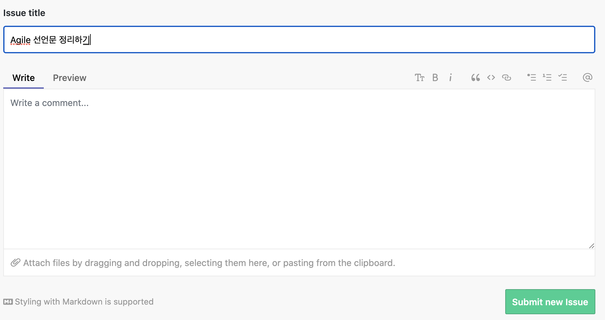

# ZenHub 알아보기

ZenHub 는 GitHub 과 통합된 Agile 프로젝트 관리를 위한 Kanban 도구이다. 

여기서 ZenHub 에 대해서 간단히 사용법을 알아보고, 용어에 대해서 정리해 볼 예정이다. 

## ZenHub 설치하기.

### 사전 필요사항

우선 ZehHub를 설치하기 위해서는 GitHub 계정이 있어야한다. GitHub 계정을 만들고, 가상의 리포지토리를 하나 만들자. 

### ZenHub 설치하기. 

ZenHub 는 GitHub 내에 MarketPlace 에서 찾을 수 있다. 

다음과 같이 Marketplace 를 선택한다. 

'zenhub' 를 검색하면 아래와 같은 플러그인들이 나온다. 

여기서 ZenHub 를 선택하자. 

ZenHub 는 아래 내용과 같이 유료이다. 그러나 개인 프로젝트에서는 무료로 사용할 수 있다. 

한 유저당 월 10달러이다. 팀에서 이용할 수 있는 정도이긴 하다. 

여기서 난 돈없는 개인이므로, Free 를 선택했다. 그리고 'Install it for free' 버튼을 클릭하면 아래와 같은 구매 내역이 나온다. 

이제 'Complete order and begin installation' 버튼을 클릭해서 설치해주자. 

### 크롬 플러그인 설치 

Zenhub 는 크롬 플러그인도 제공하며, 플러그인을 설치해주면 편리하게 ZenHub 을 크롬상에서 사용할 수 있다. 

### ZenHub 와 GitHub 인증 하기 

아래와 같이 인증을 해주면 나의 GitHub 에 설치된다. 

이제 설치가 완료 되었다. 

## ZenHub 이용하기

GitHub 에서 자신이 만들어둔 리포지토리에 이동하면 ZenHub 웰컴 화면이 나타난다. 

### 워크 스페이스 생성하기 

ZenHub 을 클릭하면 새로운 워크 스페이스를 만들 수 있다. 이는 Repository 를 선택한 후 ZenHub 탭을 클릭한 경우 나타난다. 

난 여기서 워크스페이스 이름을 AgileStudy 로 작성했다. 'Next' 를 클릭한다. 

생성하고 나면 이제는 워크스페이스를 위한 칸반 보드가 나타난다. 칸반 보드를 있는 그대로 구성했다. 

실제 필요한 개발 Pipeline 에 따라서 이 보드를 조정해 주면 된다. 'Complete Board Setup' 을 클릭하면 이제 사용할 준비가 완료된 것이다. 

보드 Pipeline 알아보기
- New Issues: 새로 생성된 이슈 카드가 위치한다. 이슈는 스토리 혹은 스토리보다 더 작은 태스크 단위가 될 수 있다. 
- Icebox: Icebox 는 ZenHub 에서 생성한 이슈이지만 우선순위가 낮거나, 우선순위를 현재는 적용할 수 없는 이슈들을 묻어두는 곳이다. 열러놓은 박스로 생각하면 된다. 
- Backlog: 백로그는 실제 작업해야할 작업 목록들을 위치한다. 백로그는 개발 해야할 이슈들을 나열하며, 우선순위로 관리하는 곳이다. 해당 스프린트(스크럼에서 스프린트) 가 완료되고 다음 스프린트 작업을 가져올때 여기서 가져오게 된다. 
- In Progress: 이번 스프린트에서 수행중인 작업을 놓는 곳이다. 이것 역시 우선순위에 따라 위에서 부터 아래로 정렬해두 둔다. 
- Review/QA: 작업이 완료된 코드는 Review/QA 에 두고 검증을 수행한다. 
- Done: Done 은 실제로 검증이 완료되고, 실제 운영에 반영된 이슈들을 놓는 곳이다. 

## ZenHub 워크스페이스 작성하기. 

이제 보드 구성이 완료 되었으므로 이제는 이슈를 생성해보자. 

ZenHub 페이지에 이동하면 아래와 같은 칸반 보드를 확인할 수 있다. 

'New Issue' 버튼을 클릭하면 아래와 같이 이슈 생성 창이 팝업된다. 

난 이슈 이름을 'Agile 선언문 정리하기' 로 작성하고 'Submit new Issue' 버튼을 클릭했다. 

생성된 이슈의 more 아이콘을 클릭하면 다양한 옵션이 있다. 

특정 사용자에 할당하거나, 해당 이슈를 피팅하거나, 레이블을 달아주는 등의 다양한 작업을 할 수 있다. 

또 다른 이슈를 계속 만든다.

### Epic 만들기 

이제는 Epic 을 만들어 보겠다. 

'New Issue' 옆에 있는 '+' 버튼을 클릭하면 아래와 같이 나온다. 

여기서 Epic 을 선택하자. 

아래와 같이 Epic 생성 창이 나왔다. 이슈나 별반 다르지 않다. 단지 에픽으로 묶어줄 내용을 적는다. 

### 용어 알아보기

ZenHub 에서 사용하는 용어, 실제에서는 Agile 에서 사용하는 작업 단위를 알아보자. 

- Issue: 이슈는 사용자 스토리 혹은 작업의 최소 단위를 말한다. Agile 에서는 Issue 역시 작은 하나의 완전한 제품이 될 수 있도록 작성한다. 
- Epic: 에픽은 이슈들의 그룹을 말한다. 이슈들이 모이면 스프린트의 작업 단위가 되며, 에픽은 한 스프린트만에 끝날 수 도 있고, 여러 스프린트를 합쳐야 하나의 제품이 나올 수 있는 정도의 크기를 말한다. (Epic 은 영어로 서사시이다. 즉, 완젼한 기능을 하는 덩어리의 제품이 되어야한다.)
- Milestone: 마일스톤은 2주단위의 스프린트 혹은 골을 의미한다. 스크럼에서는 스프린트가 Milestone 라고 보면 되겠다. 
- Release: 릴리즈는 Epic 이나 Issue 의 그룹으로 출시 단위로 묶은 것이다. 
- Pipeline: 파이프라인은 워크플로의 단계들을 모아둔 일의 순서들을 말한다. 

이제 Epic 을 만들었으니 다음으로는 각 이슈들을 Epic 으로 묶어주자. 

이슈 목록에서 더보기 아이콘을 클릭하고 'Select Issue' 를 선택하여, 에픽으로 묶어줄 이슈들을 모두 선택해준다. 

필요한 이슈를 선택하고 상단 탭에서 SetEpic 을 클릭하면 아래와 같이 에픽 선택창이 나타난다.

우리는 Agile 선언문과 실천사항 블로깅 이라는 에픽을 선택했다. 'Apply Changes' 를 선택하여 이슈를 에픽에 할당하였다. 

이펙 카드를 클릭하면 아래와 같이 이슈들이 한데 묶인 것을 볼 수 있다. 

## 작업 가져가기

이제 필요한 이슈들을 생성했으니, 작업들을 각 상태에 맞게 이동하면서 작업 상태를 표시하자. 

## WrapUp

ZenHub 를 이용하면 GitHub 리포지토리와 통합된 칸반보드를 활용할 수 있다는 것을 알아 보았다. 

다양한 칸반 보드가 많지만 GitHub 에서 직접 연동할 수 있어서 개인 프로젝트 할때 유용할듯 하다. 

